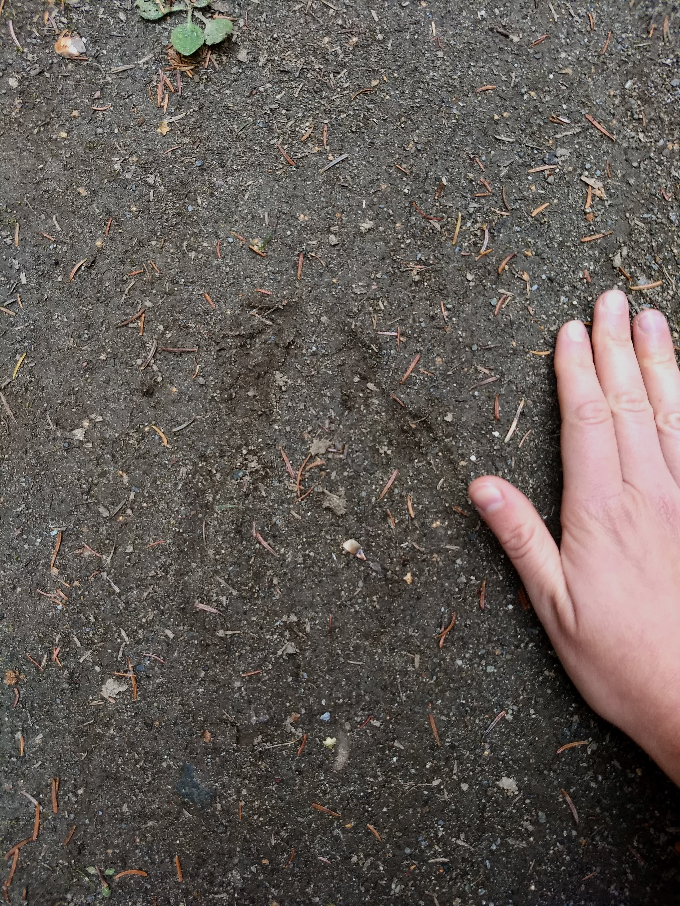

Welcome to the Teitelbaum Lab in the [Georgia Cooperative Fish & Wildlife Research Unit](https://www.usgs.gov/programs/cooperative-research-units) at the [University of Georgia](https://warnell.uga.edu/). We work on answering questions related to the ecology of wildlife populations, with many interests in animal movement, infectious disease, spatial analysis, ornithology, ecotoxicology and beyond!

We are particularly interested in making sure that our research is timely, relevant, and applicable to conservation in Georgia and beyond.

{fig-alt="A duck family swimming on a lake" style="float: left; margin-right: 20px; margin-bottom: 10px; border-radius: 8px;" width="350"} {style="float: left; margin-right: 20px; margin-bottom: 10px; border-radius: 8px;" fig-alt="American White Ibis feeding in a wetland" width="350"} {style="float: left; margin-right: 20px; margin-bottom: 10px; border-radius: 8px;" fig-alt="A bear print in mud with a GPS device for scale" width="350"} {style="float: left; margin-right: 20px; margin-bottom: 10px; border-radius: 8px;" fig-alt="A moose track in dirt with a hand for scale" width="350"}
