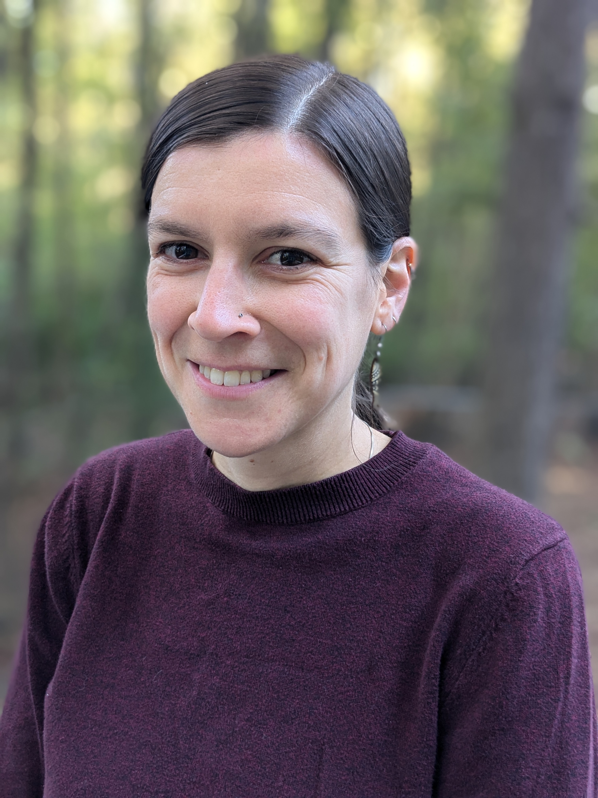
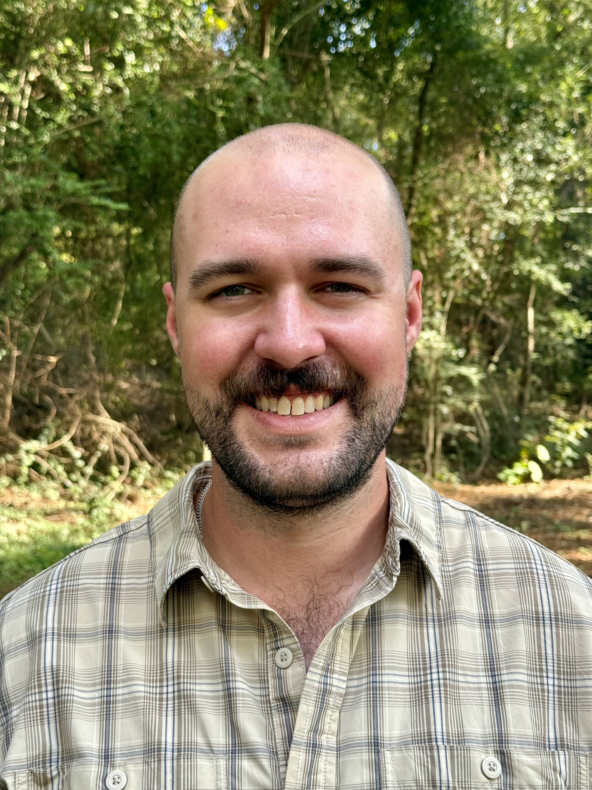
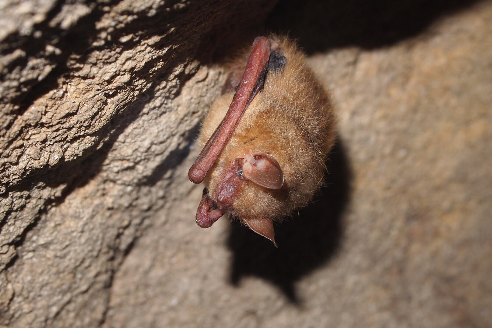

## Claire Teitelbaum (PI)

{style="float: left; margin-right: 20px; margin-bottom: 10px; border-radius: 8px;" fig-alt="A headshot of Claire Teitelbaum" width="180"}

I am an Assistant Unit Leader in the [Georgia Cooperative Fish & Wildlife Research Unit](https://www.usgs.gov/programs/cooperative-research-units) and an Adjunct Assistant Professor in the [Warnell School of Forestry and Natural Resources](https://warnell.uga.edu/) at the University of Georgia. My research is at the intersection of animal movement ecology, spatial ecology, and disease ecology. I study the effects of landscape changes on wildlife behavior and infectious diseases using mathematical and statistical models. One of the great parts about being a modeler in ecology is that I get work with data and concepts from lots of different fields and systems, so I am always learning new techniques and more natural history. I have studied whooping cranes, waterfowl, brown bears, ungulates, ibis, and bats, plus some of their parasites and pathogens. For more details on my research, please see the Research page.

I received my PhD from the Odum School of Ecology at the University of Georgia and was previously a post-doc with at the USGS Eastern Ecological Science Center (formerly Patuxent Wildlife Research Center) and NASA Ames Research Center.

Collaboration is one of my favorite parts of doing scientific research, so if you're interested in working together or just talking about a project, please get in touch!

 

## Tobias Haymes (PhD Student)

{fig-alt="A headshot of Tobias Haymes" style="float: left; margin-right: 20px; margin-bottom: 10px; border-radius: 8px;" width="180"}

I am a PhD student in Forestry and Natural Resources with an emphasis in Wildlife Sciences co-advised by Dr. Claire Teitelbaum and Dr. Sonia Hernandez. I earned my bachelor’s degree in Fisheries and Wildlife in 2022 and completed my M.S. in Forestry and Natural Resources (Wildlife Sciences) in 2025, both at the University of Georgia. My master's research focused on the “eagle-killer toxin” known as aetokthonotoxin (AETX) and its associated disease – vacuolar myelinopathy (VM). Specifically, I am interested in how AETX affects mammals, and whether it is linked to neurologic diseases in predators and scavengers. During my time as a student, I have worked for the UGA deer research lab, been a student contractor for USGS, and assisted with white-tailed deer fawn research in south Texas. I have also been a teaching assistant for several courses at the Warnell School of Forestry and Natural Resources including spatial analysis, aquatic biology, and wildlife techniques. I hope to continue researching the adverse effects of AETX and other toxins to wildlife by collaborating with state and federal researchers. Thus far I have been fortunate to explore wildlife health research at the interface of aquatic and terrestrial systems, and I am excited to learn more about these systems as I continue graduate school. I am broadly interested in all things related to wildlife disease ecology and ecotoxicology, and I am pursuing a PhD to aid my goal of working in higher education.

 

## Zach Vickers (PhD Student)

{style="float: left; margin-right: 20px; margin-bottom: 5px; border-radius: 8px;" fig-alt="A tricolored bat hanging in a cave" width="251"}

I am a PhD student in the Warnell School of Natural Resources and Forestry at the University of Georgia, currently researching habitat selection of southeastern bats, with a focus on the tricolored bat (*Perimyotis subflavus*). I received my M.S. in Biology at Missouri State University and my B.S.E.S. in Environmental Economics and Management from UGA. My scientific interests are wide-ranging and encompass the disciplines of ecology, biogeography, ethology, and more. I am especially interested in understanding the ecological processes that drive species distributions, and how populations differ in both traits and outcomes across geographic space. Having conducted wildlife research in the field for several years, I’ve gained familiarity with many unique ecosystems across the Southeast, Midwest, and West Coast of the United States. Now that I have returned to UGA, I am excited to pair my interests in natural history and data science toward research that will assist management efforts to conserve at-risk southeastern bat species.

 
