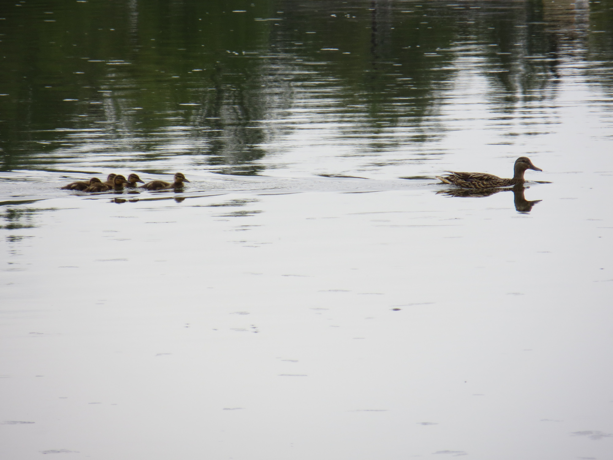
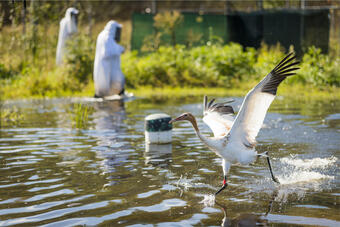

Our research is varied. We work in multiple systems and use different methods, often collaborating with other groups with expertise in lab and field techniques. Much of our research relies on compiling data from multiple sources, including individual studies, monitoring datasets, camera traps, and remote sensing. Here are a few of the themes that cut across our research:

## Landscapes, movement, and disease

{fig-alt="a group of ducks swimming on water" style="float: right; margin-left: 20px; margin-bottom: 10px; border-radius: 8px;" width="237"}

Movement is, in part, an adaptation to environments that vary in space and time. Animal movements can also have dramatic impacts on populations, communities, and ecosystems, including on the spread and transmission of infectious disease. We study these environment-movement-disease interactions and feedbacks using a combination of remotely sensed data on the environment, animal tracking, diagnostic data, and simulations. Ongoing work includes investigations into [non-migratory movements of waterfowl and their implications for the spread of highly pathogenic avian influenza](https://doi.org/10.1111/ele.70265).

## Habitat use and selection across scales

{fig-alt="a moose print in mud with a hand for scale" style="float: right; margin-left: 20px; margin-bottom: 10px; border-radius: 8px;" width="177"}

Quantifying animals' habitat requirements can improve our understanding of their natural history, which can inform local management actions and predictions for future range shifts. However, these requirements vary across life-history stages, among individuals, and among populations. By integrating multiple data sources, we aim to understand how habitat use and habitat selection vary across individuals, space, and time. Prior work on [habitat selection of moose in response to temperature](https://doi.org/10.1111/ddi.13223) and on [potential overlap between waterfowl and poultry](https://doi.org/10.1111/ecog.06939) investigated these questions. Ongoing work studies habitat use and occupancy of bats across the ecoregions of Georgia.

## Conservation, behavior, and adaptation

{fig-alt="a whooping crane takes off over water" style="float: right; margin-left: 20px; margin-bottom: 10px; border-radius: 8px;" width="264"}

Effective conservation requires understanding how individuals respond and adapt to changes in their environments. These responses might be in foraging (e.g., [brown bears in Europe](https://doi.org/10.1016/j.baae.2017.09.007) responding to supplemental ungulate feeding), migration (e.g., [reintroduced whooping cranes](https://doi.org/10.1038/ncomms12793)), or infection (e.g., [wild waterfowl and avian influenza](https://doi.org/10.1002/ecs2.4432)).
